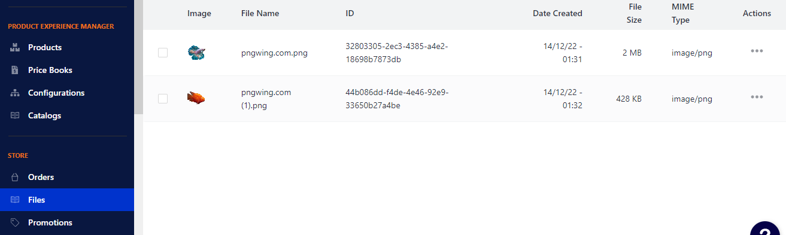

# Чат-боты на Python «Продаём рыбу в Telegram»
Учебный проект курса "От джуна до мидла" компании Devman. Пример работающего бота


# Установка и запуск
## Установка
- Скачайте код проекта
- Установите зависимости
```
pip install -r requirements.txt
```
## Создайте файл `.env`

Создайте аккаунт на [redis.com](http://redis.com) и впишите сюда хост, порт и пароль для созданной БД.
- `REDIS_PASSWORD=Пароль базы данных`
- `REDIS_HOST=Хост базы данных`
- `REDIS_PORT=Порт базы данных`

Зарегистрируйте телеграм бота. Подробная инструкция [как зарегистрировать бота](https://way23.ru/регистрация-бота-в-telegram.html)
впишите в `.env`:
- `TGM_TOKEN=Токен, который получили у Botfather`

Получите у куратора курса доступ к [Moltin](https://euwest.cm.elasticpath.com/), зарегистрируйтесь там
и со страницы [Legacy key](https://euwest.cm.elasticpath.com/application-keys#legacy-key) возьмите и добавьте в `.env`:
- `MOLTIN_CLIENT_ID=Client id со страницы`
- `MOLTIN_CLIENT_SECRET=Client Secret со страницы`

## Запуск
```
python tgbot.py
```

# Работа с магазином
### Вывести все товары в магазине в консоль
```shell
python moltin_store.py --get_all_products 
```


### Добавить продукт в магазин
```shell
python moltin_store.py --create_product --product_name <Название продукта> --sku <SKU предмета> --description <Описание продукта> --amount <Цена продукта>
```

### Пополнить запасы на складе
```shell
python moltin_store.py --create_inventory_store --product_id <ID продукта> --quantity <Количество>
```

### Удалить продукт из магазина
```shell
python moltin_store.py --del_product --product_id <ID продукта>
```

### Привязать фотографию к товару
- Загружаем картинку через [сайт]()
- Она появляется в файлах, берем от туда ID


```shell
python moltin_store.py --create_file_relationship --image_id <ID фотографии с сайта> --product_id <ID продукта>
```
